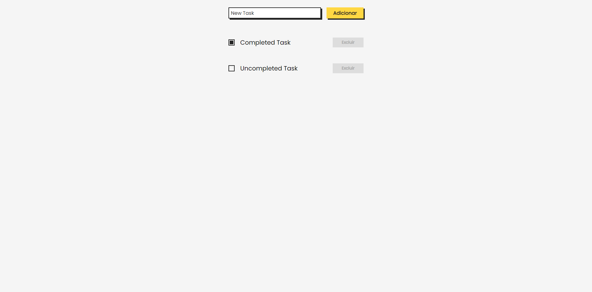

# To Do
A simple web application made with the purpose of learn JSON files management with PHP

## Technologies
- PHP
- JSON
- JS
- HTML
- CSS

## How to use
### If you have a SGBD or the Apache and PHP installed, you just need to put this files in htdocs (a.k.a www) folder and run the Apache
### Else you'll need to run your PHP server in the same directory of this files
